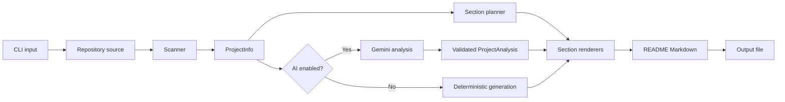

# How README Generation Works

This document explains how `readme-gen` turns a local directory or GitHub
repository into a polished `README.md`. The system separates repository facts,
optional AI-written prose, and Markdown formatting so that Gemini can improve
the writing without controlling the structure or inventing technical details.

## Pipeline at a Glance

The main orchestration lives in
[`main.py`](../src/readme_gen/main.py). Its work happens in this order:

1. Resolve the input as a local directory or GitHub URL.
2. Resolve and validate the output path.
3. Scan the repository into a fresh `ProjectInfo` object.
4. Add GitHub API metadata when the input is remote.
5. Optionally ask Gemini for structured prose.
6. Render the planned sections into Markdown.
7. Write the result as UTF-8.

## 1. CLI and Output Handling

The Typer command in [`main.py`](../src/readme_gen/main.py) accepts:

- `source`: a local path or GitHub repository URL;
- `--output` / `-o`: the destination, defaulting to `README.md`;
- `--force` / `-f`: permission to overwrite an existing destination;
- `--no-ai`: deterministic generation without Gemini;
- `--debug-metadata`: print safe normalized metadata and exit without writing.

For a local repository, a relative output path is resolved inside that
repository. For a GitHub URL, it is resolved from the caller's current working
directory because the downloaded repository is temporary.

The output file is checked before scanning. Unless `--force` is supplied, an
existing file is preserved and generation stops with an actionable message.

## 2. Repository Sources

[`repository/resolver.py`](../src/readme_gen/repository/resolver.py) selects one
of two source implementations:

- `LocalRepositorySource` validates and exposes an existing directory.
- `GitHubRepositorySource` parses the URL, retrieves GitHub metadata, downloads
  an archive, and exposes its contents through a temporary directory.

Both produce the same `RepositoryContext`, so everything after source
resolution works against a normal filesystem path. This keeps local and remote
analysis on one shared scanning pipeline.

Remote metadata is converted into the provider-neutral `RepositoryMetadata`
model by
[`repository/metadata.py`](../src/readme_gen/repository/metadata.py). Local
manifest facts remain authoritative; GitHub values fill gaps such as the
description, license, homepage, topics, default branch, and repository links.

## 3. The Central Data Model

[`models.py`](../src/readme_gen/models.py) defines the facts exchanged between
the scanner, AI analyzer, planner, and renderers.

`ProjectInfo` is the central object. It begins with only the repository root and
directory name, then detectors enrich it with information such as:

- languages, frameworks, libraries, services, and package managers;
- dependencies and development dependencies;
- packages, components, commands, and interfaces;
- API routes, environment variable names, assets, and workflows;
- repository structure, important files, and selected context files;
- repository metadata and the planned README sections;
- optional `ProjectAnalysis` prose returned by Gemini.

Smaller typed records such as `ProjectCommand`, `TechnologyInfo`,
`EnvironmentVariable`, `Interface`, and `UsageExample` preserve provenance and
meaning instead of passing loosely structured strings through the pipeline.

Every CLI invocation builds a new `ProjectInfo`; there is no persistent
metadata cache that must be cleared between runs.

## 4. Repository Scanning and Detection

[`scanner.py`](../src/readme_gen/scanner.py) walks the repository once, filters
ignored directories, and coordinates the detector modules under
[`detectors/`](../src/readme_gen/detectors/).

The detectors have focused responsibilities:

| Detector area | Examples of evidence |
| --- | --- |
| Metadata | `pyproject.toml`, `package.json`, Git remote, license files |
| Languages and technology | File extensions, dependencies, manifests, framework imports |
| Packages and dependencies | Python, JavaScript, Rust, Go, Java, and .NET manifests |
| Commands | Package scripts, build tools, test tools, Make targets, CLI entry points |
| Interfaces | CLI programs, HTTP routes, packages, executable targets |
| Project shape | Components, source/test directories, deployment files, project type |
| Documentation | Existing README usage blocks, quick-start guides, screenshots |
| Operations | Workflows and environment variable names |

Detection is evidence-driven. A filename or dependency should not become a
definite user-facing claim unless the detector has enough supporting context.
Generated directories such as virtual environments, build output, caches,
dependencies, and coverage output are excluded from the tree and most scans.

After command and route detection,
[`normalization.py`](../src/readme_gen/normalization.py) converts
framework-specific facts into generic interfaces. For example, a discovered
HTTP route and a detected CLI command can be rendered through the same
provider-neutral interface model.

Existing documentation is useful evidence, but it is filtered. The usage
example detector only accepts concise fenced examples, rejects configuration
blocks, and drops unresolved template syntax such as
`{{cookiecutter.project_slug}}` so placeholders cannot leak into generated
output.

## 5. Section Planning

[`planning.py`](../src/readme_gen/planning.py) decides which sections the
repository can support. This happens before prose generation.

Examples include:

- Installation requires a package, install command, or supported package
  manager.
- Building and Testing require detected commands of the corresponding kind.
- API Endpoints requires an HTTP interface.
- Environment Variables requires detected variable names.
- Screenshots requires an actual screenshot asset path.
- License requires local or repository license evidence.

This produces `project.section_plan`, an ordered list of section identifiers.
The plan prevents both the no-AI and AI paths from emitting empty or
unsupported sections. When GitHub metadata is applied, the plan is recalculated
so newly available repository facts can affect the result.

## 6. Optional Gemini Analysis

Unless `--no-ai` is used,
[`ai/analyzer.py`](../src/readme_gen/ai/analyzer.py) sends Gemini a prompt built
by [`ai/prompts.py`](../src/readme_gen/ai/prompts.py).

The prompt contains:

- normalized structured metadata from `ProjectInfo`;
- a small set of selected manifest and source excerpts;
- the section plan;
- rules forbidding unsupported claims, promotional filler, secrets, emojis,
  and invented commands or capabilities.

Environment file values and likely secrets are redacted before context is sent.
Gemini must respond against the `ProjectAnalysis` schema with exactly five
content areas:

- `tagline`;
- `summary`;
- `highlights`;
- `usage_summary`;
- `architecture`.

Gemini does not generate the complete Markdown document or choose its layout.
The response is schema-validated, and emoji are removed from every returned
field as a safeguard if the model ignores the prompt.

With `--no-ai`, this phase is skipped. Detected facts, commands, examples,
badges, and structure still produce a useful README, while AI-only prose
sections remain empty when no deterministic content supports them.

## 7. Deterministic Markdown Rendering

[`generator.py`](../src/readme_gen/generator.py) delegates to the formatting
package. [`formatting/layout.py`](../src/readme_gen/formatting/layout.py) maps
the section plan to renderer functions, and
[`formatting/sections.py`](../src/readme_gen/formatting/sections.py) renders each
section.

Renderers are responsible for exact Markdown such as:

- the centered title, tagline, badges, and repository links;
- tables for technologies, endpoints, environment variables, and repository
  facts;
- fenced installation, build, test, and usage commands;
- detected examples and screenshots;
- architecture prose and a semantic project tree;
- license text and links.

[`formatting/badges.py`](../src/readme_gen/formatting/badges.py) renders badges
selected from detected technologies and repository facts.
[`formatting/structure.py`](../src/readme_gen/formatting/structure.py) builds a
small annotated tree instead of dumping every file.

Each renderer may return an empty string if its required data is absent. The
layout joins only non-empty sections with consistent spacing, then ensures the
document ends with one newline.

## 8. Accuracy and Integrity Safeguards

The pipeline uses several layers of protection:

- fresh metadata is collected on every run;
- ignored and generated directories do not pollute detection;
- GitHub metadata fills gaps without overriding stronger local facts;
- section planning requires evidence before rendering;
- Gemini receives redacted, bounded context and a strict response schema;
- AI output is normalized before use;
- unresolved Cookiecutter and Jinja examples are rejected;
- unverified `pip install <project>` examples are not rendered;
- `--force` is required before overwriting an existing output file;
- `--debug-metadata` makes detector decisions inspectable without calling AI
  or changing files.

The current writer creates the final text in memory and then writes it directly
to the destination. A future integrity improvement would be to write a
temporary file in the destination directory and atomically replace the target
only after the complete UTF-8 document is ready.

## 9. Adding New Capabilities

To add a newly detected fact:

1. Add or extend a typed model in `models.py`.
2. Implement a focused detector under `detectors/`.
3. Call it from `scan_project()` and store its result on `ProjectInfo`.
4. Normalize provider-specific data if multiple ecosystems expose the same
   concept.
5. Update `plan_readme_sections()` if the fact controls section availability.
6. Add or update a deterministic renderer.
7. Include safe metadata in the Gemini payload only if it helps prose quality.
8. Add detector, planner, renderer, and end-to-end tests appropriate to the
   change.

To add a new section, define a renderer in `formatting/sections.py`, register it
in the renderer mapping in `formatting/layout.py`, add planning conditions, and
test both the presence and absence cases. Keeping detection, planning, prose,
and rendering separate is what allows the output to remain polished without
sacrificing factual accuracy.

